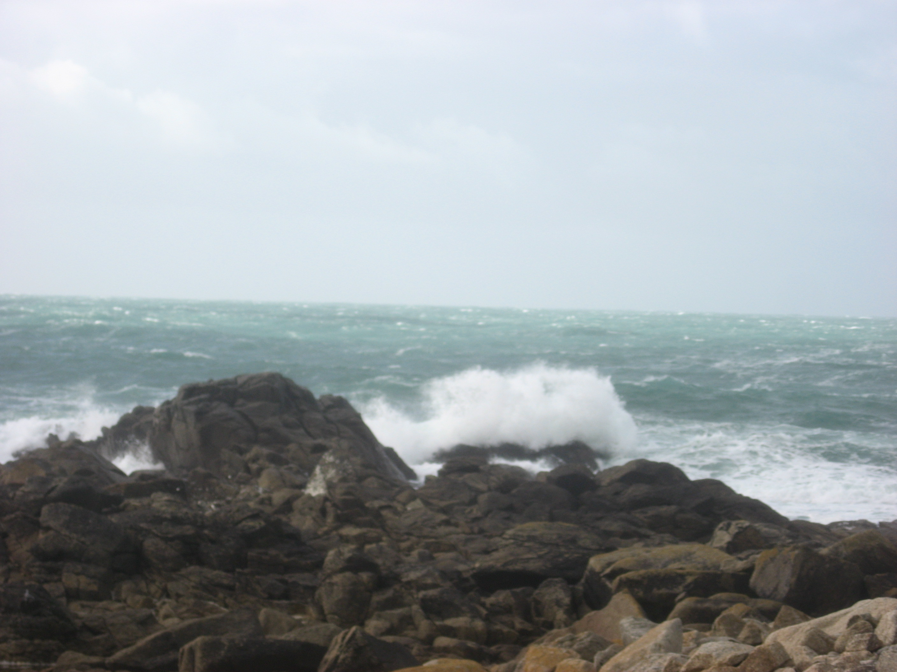
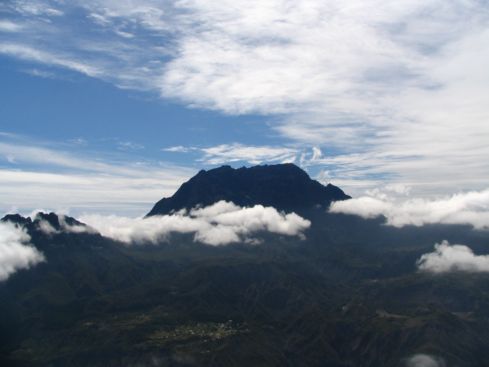

# Similar Image Search Example

## Requirement

* pytorch 1.0
* torchvision
* numpy
* cv2
* elasticsearch

## Download INRIA Holidays dataset

```bash
bash prepare.sh
```

## Search answers using elasticsearch plugin

```bash
python search_example.py --query "./images/143700.jpg"
                         --result_size 5
```

```json
{
  "took": 8,
  "timed_out": false,
  "_shards": {
    "total": 5,
    "successful": 5,
    "skipped": 0,
    "failed": 0
  },
  "hits": {
    "total": 287,
    "max_score": null,
    "hits": [
      {
        "_index": "images",
        "_type": "image",
        "_id": "plcrb2gBaJEWlukYw7kH",
        "_score": 0.24182819,
        "_source": {
          "description": "dataset/jpg/126201.jpg"
        },
        "sort": [
          0.24182819
        ]
      },
      {
        "_index": "images",
        "_type": "image",
        "_id": "v1crb2gBaJEWlukYhbhJ",
        "_score": 0.2570988,
        "_source": {
          "description": "dataset/jpg/126200.jpg"
        },
        "sort": [
          0.2570988
        ]
      },
      {
        "_index": "images",
        "_type": "image",
        "_id": "uVcsb2gBaJEWlukYD7pf",
        "_score": 0.25885358,
        "_source": {
          "description": "dataset/jpg/101504.jpg"
        },
        "sort": [
          0.25885358
        ]
      },
      {
        "_index": "images",
        "_type": "image",
        "_id": "e1crb2gBaJEWlukYt7mo",
        "_score": 0.27128482,
        "_source": {
          "description": "dataset/jpg/101502.jpg"
        },
        "sort": [
          0.27128482
        ]
      },
      {
        "_index": "images",
        "_type": "image",
        "_id": "WVcrb2gBaJEWlukYrrlh",
        "_score": 0.28078148,
        "_source": {
          "description": "dataset/jpg/101503.jpg"
        },
        "sort": [
          0.28078148
        ]
      }
    ]
  }
}
```

### Sample Image Query



### Search Result


<p float="left">
   
  
  
  
  
</p>
